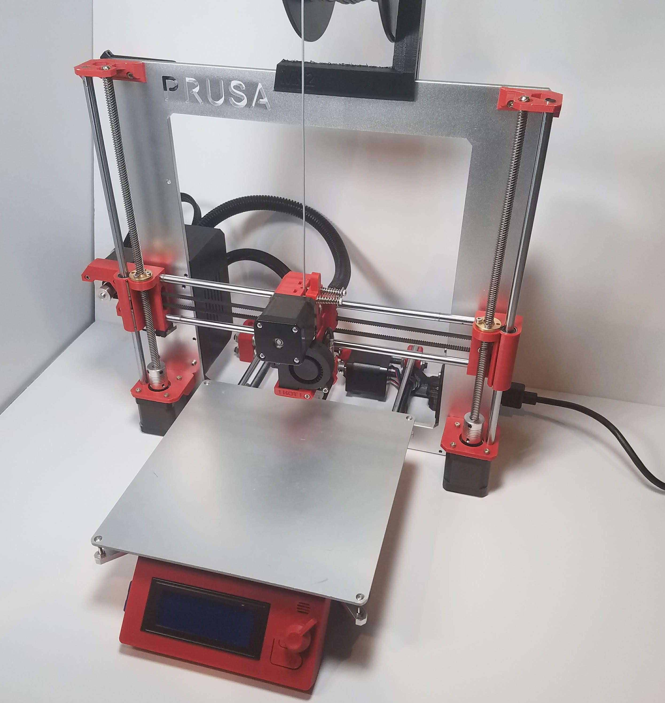

# NOAMi3

## Welcome

This is a remix of the Prusa i3 printer.

This is an earlier version of the printer.

## The goals

* To make the process of building your own printer easy and in-expensive by using lower cost off the shelf components
    - RAMPS compatible main boards
    - MKS Gen 1.4
* Rework some of the design decisions that were made like eliminating the inductive PINDA probe sensor and Bed levelling using multiple independent Z motors.
* Apply latest advancements and make them work with all i3 based printers.
    - Examples include: filament runout sensor, mk3s style extruder

## Cost

All components are easly sourced or you can buy the parts from my [ebay store](https://www.ebay.com/usr/numberf55). 

## Work in progress:

June 24, 2020: Still working on getting the case for the MKS GEN 1.4 board.

Notes:

Originates in Original Prusa i3 MK3S is a 3D printer project maintained by PRUSA RESEARCH.
Originates in RepRap project.
This repository contains SCAD files and STLs of the printed parts.
